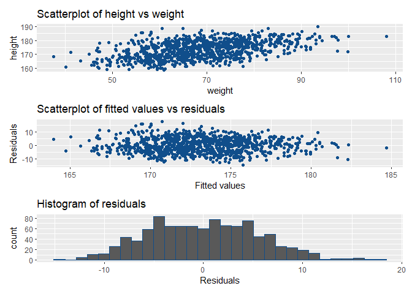
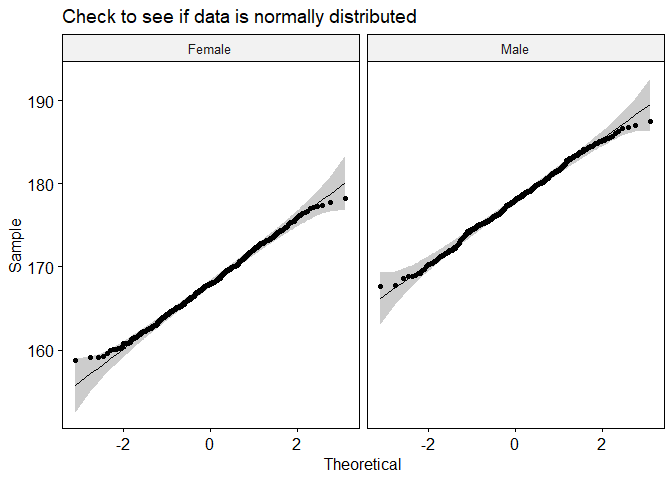

<!-- README.md is generated from README.Rmd. Please edit that file -->

# project

<!-- badges: start -->
<!-- badges: end -->

The goal of project is to do statistical tests! \#\# Installation

You can install the released version of project from
[CRAN](https://CRAN.R-project.org) with:

``` r
install.packages("project")
```

And the development version from [GitHub](https://github.com/) with:

``` r
# install.packages("devtools")
devtools::install_github("Sean-Spence/project")
```

## Example

This package does statistical test to see if there is a linear
relationship with height and weight, test if the mean height of male and
female are the same and see if there is an association between gender
and the level of physical activity.

``` r
library(project)
## basic example code
```

## My Test 1

Mytest1 tests if there is any linearity between height and weight.

``` r
mytest1("C:/Users/seans/Documents/University/2021\ Semester\ Two/STAT1378/Individual\ Project/Individual\ Project/project.csv")
#> *R is going to read the file and analyse C:/Users/seans/Documents/University/2021 Semester Two/STAT1378/Individual Project/Individual Project/project.csv and conduct a linear
#>       regression with custom output. The assumption is that the file containing
#>       the data set is a csv file with the same headings so this test can be repeated
#>       with different data set. .*
#> 
#> 
#> HYPOTHESIS
#> The null hypothesis H0 is beta = 0, and the alternative hypothesis
#>        H1 is beta does not equal to 0. Beta is the true slope parameter as in the
#>        model height = alpha + beta weight + epsilon.
#> 
#> Assumptions
#> There are three assumptions which can be seen in the plot. 1)
#>       plotting height vs weight we can see if there are any linear relationship. 2)
#>       The fitted values vs residuals need to be scattered randomly and have no pattern.
#>       3) The distribution of residuals  needs to be a normal distribution.
#> `stat_bin()` using `bins = 30`. Pick better value with `binwidth`.
```



    #> 
    #> FIT - Linear Regression
    #> beta_hat =  0.2932118 
    #> p_value =  1.627962e-60 
    #> DECISION
    #> Reject NULL hypothesis 
    #> 
    #> CONCLUSION
    #> There is evidence that the slope (beta) is different
    #> than 0. There is a significant linear relationship
    #> between height and weight. For each unit-increse
    #> in weight, height increases by
    #> 0.2932.

To look at the documentation,

``` r
?q1
#> No documentation for 'q1' in specified packages and libraries:
#> you could try '??q1'
```

## My Test 2

Mytest2 tests if the mean height of males are the same as the female.

``` r
mytest2("C:/Users/seans/Documents/University/2021\ Semester\ Two/STAT1378/Individual\ Project/Individual\ Project/project.csv")
#> *R is going to read the file and analyse C:/Users/seans/Documents/University/2021 Semester Two/STAT1378/Individual Project/Individual Project/project.csv and conduct a two
#>         sample t-test on the data. The assumption is that the file containing
#>         the data set is a csv file with the same headings so this test can be repeated
#>         with different data set. .*
#> 
#> 
#> HYPOTHESIS
#> The Null hypothesis H0 is meu1=meu2 where the means in the
#>         height of male and female are the same and the alternate hypothesis H1 is
#>         meu1 does not equal meu2 where the height of male does not equal to height
#>         of female.
#> 
#> ASSUMPTIONS
#> There are three assumptions for the t-test which need to be
#>         confirmed before we can move on. 1) Making sure the data has no outlier. 2)
#>         Assume equal variance between male and female heights. 3) Check that the
#>         data is normally distributed between the two categorical variables.
#> # A tibble: 2 x 4
#>   gender variable statistic     p
#>   <chr>  <chr>        <dbl> <dbl>
#> 1 Female height       0.996 0.250
#> 2 Male   height       0.996 0.201
```



    #> 
    #> T-Test
    #> p_value = 1.58e-215 
    #> DECISION
    #> Reject NULL hypothesis 
    #> 
    #> CONCLUSION
    #> There is evidence that the mean for male and female
    #> height are different at a 5% signifance level.

To look at the documentation,

``` r
?q2
#> No documentation for 'q2' in specified packages and libraries:
#> you could try '??q2'
```

## My Test 3

Mytest3 tests is there is any association with gender and the level of
physical activity.

``` r
mytest3("C:/Users/seans/Documents/University/2021\ Semester\ Two/STAT1378/Individual\ Project/Individual\ Project/project.csv")
#> *R is going to read the file and analyse C:/Users/seans/Documents/University/2021 Semester Two/STAT1378/Individual Project/Individual Project/project.csv and conduct a chi
#>         square test on the data. The assumption is that the file containing
#>         the data set is a csv file with the same headings so this test can be repeated
#>         with different data set. .*
#> 
#> 
#> HYPOTHESIS
#> The Null Hypothesis H0 is where there is no relationship betweeen
#>         gender and the level of physical activity. The alternate hypothesis H1 is
#>         there is a relationship between gender and the amount of physical activity.
#> 
#> ASSUMPTIONS
#> There are several assumptions for the Chi-square test of
#>         independence test. Some of them include
#>         1)Each study group must be independent,
#>         2) The value of the expected value cells should be 5 or more and no less than
#>         1, and
#>         3)The categories of the variables are mutually exclusive
#>      [,1] [,2] [,3]
#> [1,]  127  255  125
#> [2,]  116  242  135
#> 
#> CHI SQUARE VALUES
#> p_value =  0.598 
#> chi_sq_statistic = 1.026799 
#> critical_value = 5.991465 
#> DECISION
#> Do not reject NULL hypothesis 
#> 
#> CONCLUSION
#> There is no evidence that there is a relationship
#> between gender and the level of physical activity
#> at a 5% signficance
#> level.
```

To look at the documentation

``` r
?q3
#> No documentation for 'q3' in specified packages and libraries:
#> you could try '??q3'
```
